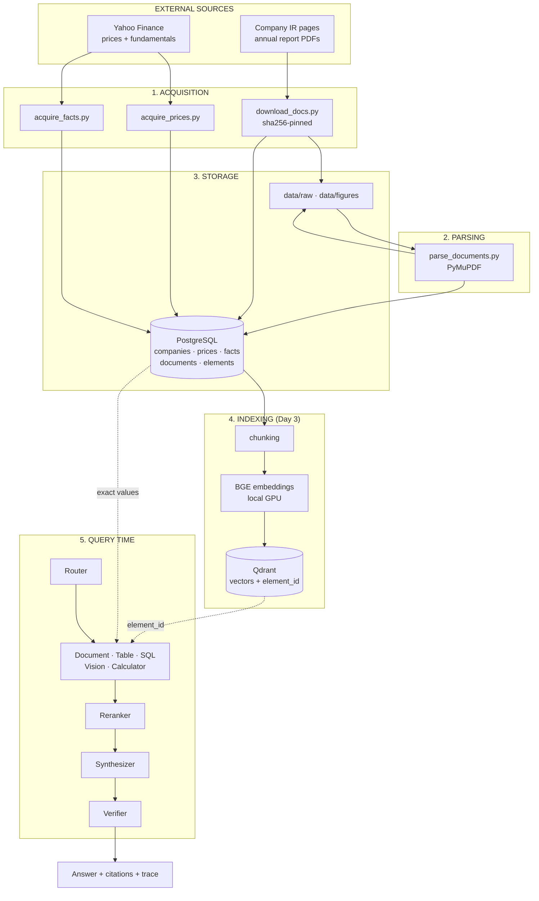

# Data flow

Where every byte comes from, what happens to it, and how it reaches an answer.

**Status:** ✅ stages 1–4 built · 🔜 stages 5–8 designed

---

## The whole pipeline at a glance



---

## Stage 1 — Acquisition ✅

### 1a. Prices — `scripts/acquire_prices.py`

```
configs/companies.yaml  →  yfinance .NS  →  drop_partial_bar()  →  prices
```

| | |
|---|---|
| Source | Yahoo Finance via `yfinance`, symbols suffixed `.NS` |
| Window | 5 years of daily bars |
| Volume | **14,879 rows** across 12 companies |
| Idempotent | `ON CONFLICT (ticker, trade_date) DO NOTHING` |

**The trap this stage handles:** while a market is open — and occasionally on a
completed session, as happened with DRREDDY on 2026-09-04 — Yahoo returns a row
with Open/High/Low/Volume populated and **`Close` = NaN**. `df.iloc[-1]["Close"]`
is then NaN in production, and only sometimes. `drop_partial_bar()` removes any
row without a close.

### 1b. Financial facts — `scripts/acquire_facts.py`

```
yfinance income_stmt / balance_sheet / cashflow
        → melt wide→long → infer_unit(concept, currency) → facts
```

| | |
|---|---|
| Source | Yahoo Finance normalised statements |
| Coverage | 5 fiscal years × ~174 line items per company |
| Volume | **8,532 facts**, FY2022–FY2026 |
| Idempotent | `ON CONFLICT (ticker, statement, concept, period_end) DO UPDATE` |

**Two rules enforced here:**

1. **Currency comes from `financialCurrency`, never from the exchange suffix.**
   INFY quotes in INR and reports in USD. Assuming otherwise makes Infosys look
   ~85× smaller than Wipro and breaks every cross-company comparison.
2. **NaN is dropped, not written as 0.** An absence of evidence is not a zero,
   and a fabricated zero would corrupt the oracle.

### 1c. Documents — `scripts/download_docs.py`

```
configs/documents.yaml → HTTP GET → verify content-type → sha256 → data/raw/ + documents
```

| | |
|---|---|
| Source | Company investor-relations pages |
| Volume | **6 PDFs, 2,056 pages, ~68 MB** |
| Verification | sha256 pinned into the manifest on first fetch |

Behaviour:

- File present **and** checksum matches → skipped.
- File present, checksum **disagrees** → hard error. The source changed under us;
  that is never silently overwritten.
- Download interrupted → written to `.part` and renamed only on completion, so a
  truncated PDF never looks cached.
- `fetch: manual` → the IR site blocks automated requests (verified for
  `tcs.com` and `infosys.com`, HTTP 403 even with browser headers). The script
  prints the URL and target path; the checksum still guarantees reproducibility.

**No PDF is ever committed to git.** `data/` is ignored; the manifest plus these
scripts reconstruct the corpus byte-for-byte.

---

## Stage 2 — Parsing ✅ — `scripts/parse_documents.py`

```
PDF → PyMuPDF → tables (claim regions) → text blocks (skip claimed) → figures → elements
```

Per page, in this exact order:

1. **Tables first.** `page.find_tables()`. Each becomes a `TABLE` element with a
   linearised `text` (for embedding) *and* `table_json` (exact values, for
   arithmetic). Its bbox is added to a **claimed** list.
2. **Text blocks second**, skipping any block overlapping a claimed region.
   Without this every number in every table appears twice — once structured,
   once as mangled loose text — and the retriever ranks the mangled copy higher.
3. **Headings** are text blocks whose largest font is ≥ 1.15× the page median.
   Relative, not absolute: annual-report typography varies far too much between
   designers to hardcode a point size.
4. **Figures**, filtered to ≥ 120 px per side and ≥ 40,000 px². Written to
   `data/figures/<document_id>/` as `FIGURE` elements with `image_path` set and
   `text` empty — the figure is *stored*, not yet *understood*.

**Result: 46,241 elements**

| Type | Count |
|---|---:|
| text | 37,675 |
| heading | 6,171 |
| table | 1,977 |
| figure | 418 |

Every element carries `document_id`, `page`, `seq`, `bbox`, and a deterministic
`element_id` of the form `TCS-annual_report-FY2025-deadbeef:p0042:e0001`.
Zero-padding means lexical sort equals document order.

**No OCR anywhere.** All six PDFs carry a real text layer at 2,400–7,000
chars/page. Adding OCR would cost minutes per document and lose accuracy.

---

## Stage 3 — Storage ✅

See [storage.md](storage.md) for the full rationale. In short:

| Store | Holds | Role |
|---|---|---|
| PostgreSQL | companies, prices, facts, documents, elements | **truth** |
| `data/raw/` | source PDFs | reproducible, git-ignored |
| `data/figures/` | 418 extracted images | Vision Agent input |
| Qdrant 🔜 | chunk vectors + `element_id` | **findability** |

---

## Stage 4 — The join ✅

`ticker` is the spine.

```
companies.ticker
    ├──► prices     (ticker, trade_date)
    ├──► facts      (ticker, period_end)        ← ORACLE
    └──► documents  (ticker, fiscal_year)
              └──► elements (document_id, page, seq)
                        └──► chunks ──► Qdrant 🔜
```

**Why no mapping table is needed:** Indian FY2024-25 ends 2025-03-31.
`documents.fiscal_year = 2025` and `facts.period_end = 2025-03-31`, so:

```sql
JOIN facts f
  ON f.ticker = d.ticker
 AND EXTRACT(YEAR FROM f.period_end) = d.fiscal_year
```

### The number bridge

Ticker and year find the right *document*. The benchmark needs the right *page*,
and that link is made by the values themselves — `src/analyst/numfmt.py`.

```
facts.value = 520,412,500,000          (₹52,041 cr, absolute rupees)
      │
      ▼  candidate_strings() — 6 scales × 3 groupings × 3 precisions
  "520,412.5"  "5,20,412.5"  "5204125"  "52,041"  "52041"  …
      │
      ▼  substring search over elements.text (whitespace-normalised)
  MATCH → SUNPHARMA-…-FY2025:p0259:e0003   (page 259, type=table)
```

Whitespace is stripped from both sides because PDF extraction routinely splits a
figure — `9,64, 693` — including with non-breaking and thin spaces.

**Verified against real documents** (`scripts/demo_oracle_link.py`):

| Fact | Oracle | Found as | Page | Report's scale |
|---|---|---|---:|---|
| SUNPHARMA Total Revenue | ₹52,041 cr | `520,412.5` | 259 (table) | ₹ million |
| SUNPHARMA Net Income | ₹10,929 cr | `109,290` | 6 (text) | ₹ million |
| ICICIBANK Net Income | ₹51,029 cr | `510,291,955` | 266 (table) | ₹ thousand |
| SUNPHARMA Gross Profit | ₹39,844 cr | — | — | **discarded** |

The last row is the safety valve: **a fact that cannot be located is dropped
from the benchmark, not scored as a failure.** A Yahoo-versus-filing
disagreement, or a formatting guess we did not anticipate, is not the
retriever's fault. Mismatches reduce coverage; they never corrupt the metric.

🧭 **Open:** raw match rate is 47–57% per document and **includes false
positives** — a 4-digit figure can collide by chance across 300 pages. Day 3
tightens this by requiring the matched number to co-occur with its concept
label, then re-measures. Treat the current number as a ceiling, not a score.

---

## Stage 5 — Indexing 🔜 (Day 3)

```
elements → chunking → BGE embeddings (local GPU) → Qdrant
```

- Table elements are **not** split. A table cut in half is worse than useless.
- Text elements are grouped under their preceding heading, then split with
  overlap.
- Every vector's payload carries `element_id`, `document_id`, `ticker`,
  `fiscal_year`, `page`, `type` — enough to filter before searching and to cite
  after.
- Embeddings run locally on the RTX 3050. At ~109M–568M parameters they fit
  4 GB VRAM comfortably; this is what the GPU is *for*.

---

## Stage 6 — Retrieval 🔜 (Days 3–4)

```
question → embed → Qdrant ANN (+ metadata filter) → candidates
        → BM25 sparse → fuse (RRF) → cross-encoder rerank → top-k
```

Metadata filtering happens **before** the vector search where possible: if the
question names a company and a year, there is no reason to search 46,000
elements when a few thousand qualify.

---

## Stage 7 — Reasoning 🔜 (Day 5)

| Agent | Reads from | Never does |
|---|---|---|
| Document | Qdrant → Postgres elements | arithmetic |
| Table | `elements.table_json` | read from `elements.text` |
| SQL | Postgres, **read-only role** | write, DDL, or unbounded scans |
| Vision | `data/figures/` via a VLM | assert numbers absent from the image |
| Calculator | values handed to it | parse text |

**The rule the whole design turns on:** Postgres owns truth, Qdrant owns
findability, Python owns arithmetic, the LLM owns language. The model never
computes a number and never asserts one it was not given.

---

## Stage 8 — Answer 🔜 (Day 6)

```
retrieved elements → context builder (token budget, dedupe, provenance)
    → synthesizer (structured output with inline citations)
    → verifier: is every number traceable to a retrieved element?
         yes → answer + citations + trace
         no  → "I don't have enough evidence in the available sources"
```

---

## Worked example, end to end

> *"How much did Sun Pharma's revenue grow in FY2025, and what does the report say about why?"*

| Step | What happens | Source of truth |
|---|---|---|
| 1. Route | Needs numbers **and** narrative → SQL + Document | — |
| 2. SQL | `SELECT value FROM facts WHERE ticker='SUNPHARMA' AND concept='Total Revenue' AND period_end IN (…)` | Postgres |
| 3. Calculate | Growth computed in Python from those exact values | Python |
| 4. Retrieve | Embed question → Qdrant → `element_id`s → fetch elements | Qdrant → Postgres |
| 5. Rerank | Cross-encoder orders passages about growth drivers | — |
| 6. Synthesize | Prose citing p.259 (the table) and the narrative page | LLM |
| 7. Verify | Every figure traceable to a retrieved element? | — |
| 8. Answer | Result + citations + which agents ran and why | — |
