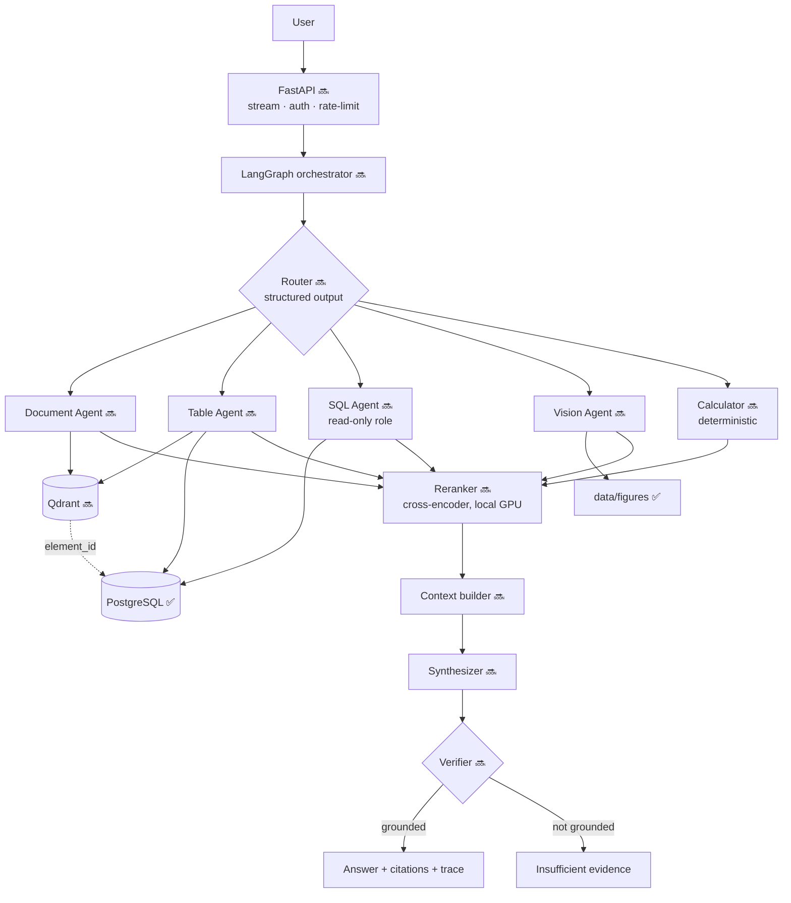
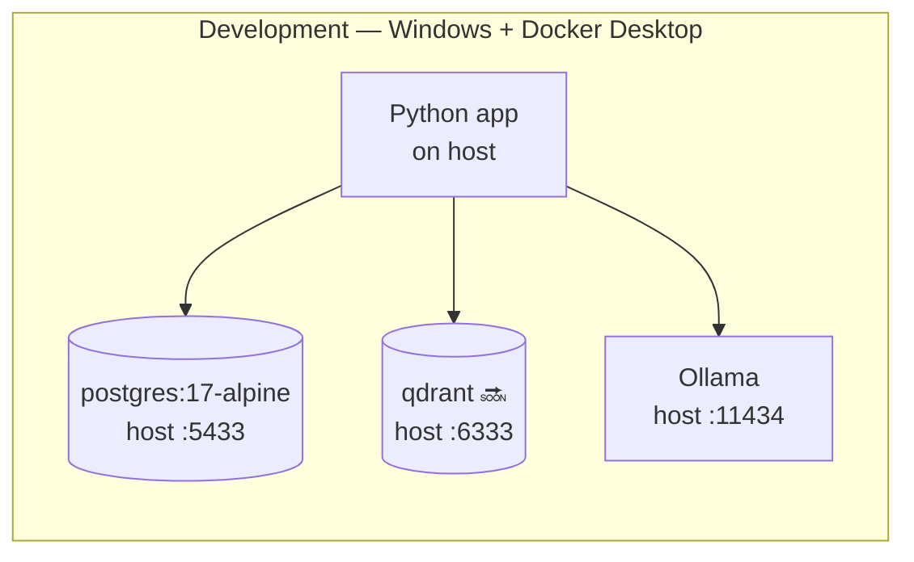

# Architecture overview

**Status:** ✅ ingestion + storage built · 🔜 retrieval, agents, serving designed

---

## The problem this shape solves

A single-path RAG system embeds the question, runs a cosine search, stuffs the
top chunks into a prompt and generates. That path answers *"what risks does the
report mention?"* well and fabricates *"what was revenue in FY25?"* confidently,
because **text similarity is a poor retrieval mechanism for an exact number**.

So the first decision is not *how to retrieve* but *what kind of question this
is*. Everything below follows from that.

---

## Component map

---

## Subsystems

| # | Subsystem | Responsibility | Status |
|---|---|---|---|
| 1 | Acquisition | Reproducible download of prices, financials, PDFs | ✅ |
| 2 | Parsing | PDF → typed elements with page + bbox provenance | ✅ |
| 3 | Storage | Postgres (truth), filesystem (binaries) | ✅ |
| 4 | Indexing | Chunking, embeddings, vector store | 🔜 Day 3 |
| 5 | Retrieval | Hybrid dense+sparse, metadata filters, reranking | 🔜 Days 3–4 |
| 6 | Agents | Document, Table, SQL, Vision, Calculator | 🔜 Day 5 |
| 7 | Orchestration | Routing, state, fan-out/fan-in | 🔜 Day 6 |
| 8 | Verification | Groundedness, citation validity, abstention | 🔜 Day 6 |
| 9 | Serving | FastAPI + Streamlit | 🔜 Day 6 |
| 10 | Evaluation | Auto-generated benchmark, retrieval + generation metrics | 🔜 Day 3 onward |

Subsystems 2 and 3 gate everything: if parsing is bad, no amount of clever agent
design recovers it. That is why the parser was chosen by
[measurement](../adr/0004-pdf-parser.md) rather than reputation.

---

## The four ownership rules

Every design argument in this project reduces to these.

| Owner | Owns | Never does |
|---|---|---|
| **PostgreSQL** | Exact values, joins, filters | approximate anything |
| **Qdrant** | Findability — which elements are relevant | hold an authoritative value |
| **Python** | Arithmetic | interpret prose |
| **LLM** | Language — routing, synthesis, explanation | compute, or assert a number it was not given |

The LLM is the least trusted component in the system. It receives values; it
does not produce them.

---

## Model placement, and why

Measured on the development machine: **RTX 3050 Laptop, 4 GB VRAM**, 15.3 GB RAM.

| Workload | Where | Why |
|---|---|---|
| Embeddings (109M–568M) | **Local GPU** | Fits comfortably; batch work; unmetered |
| Cross-encoder reranker | **Local GPU** | Same |
| Vision / figure description | **Local GPU**, offline batch | `qwen3-vl` spills to CPU but this is not latency-critical |
| Routing, synthesis, verification | **Groq API** | 5+ calls per query; a local 8B model at ~8 tok/s means 90–150 s per question |

An agentic query makes many sequential LLM calls, so generation latency
multiplies. Embeddings are single-pass and batchable, so they do not.
**The GPU's job here is embeddings, reranking and vision — not generation.**

🧭 The AWS deployment target has **no GPU**, so the deployed configuration is
API-inference-only. That is why the model backend must be swappable by
configuration rather than by code change. Local models are a *benchmark
artifact*, not a deployment dependency — see [ADR-002](../adr/0002-llm-provider-stack.md).

---

## Runtime topology

The data plane runs in Docker; the application runs on the host during
development. That keeps the edit-run loop fast and avoids rebuilding an image on
every change. Everything is containerised on Day 7 for deployment.

---

## Cross-cutting concerns

| Concern | Approach | Status |
|---|---|---|
| Configuration | `pydantic-settings`, one `Settings` object; nothing reads `os.environ` directly | ✅ |
| Secrets | `SecretStr`; `database_url` is a plain property, **not** a `computed_field`, because computed fields land in `model_dump()` and logs | ✅ |
| Logging | `structlog`, key=value events — the same events become the user-facing reasoning trace | ✅ |
| Migrations | Alembic from the first commit | ✅ |
| Types | `mypy --strict` across src, scripts and tests | ✅ |
| Determinism | Element and document IDs are content-derived, so re-parsing never invalidates an index or an eval set | ✅ |
| Prompt injection | Retrieved documents are treated as **data, never instructions** | 🔜 Day 6 |
| SQL safety | Read-only role, validated queries, row limits, statement timeout | 🔜 Day 5 |

---

## Related

- [Data flow](data-flow.md) — the byte-level path
- [Storage](storage.md) — what lives where, and how vectors are stored
- [Database schema](../data/schema.md) — generated reference
- [Decision records](../adr/) — why, and what was rejected
