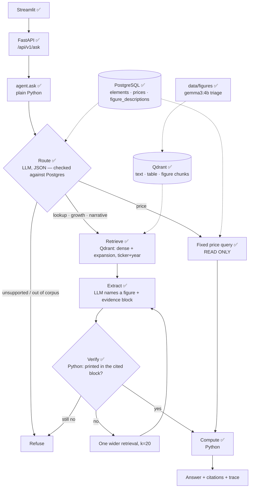
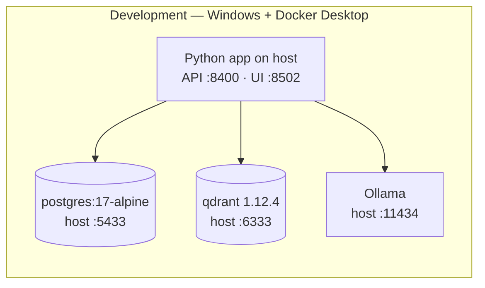

# Architecture overview

**Status:** ✅ ingestion, storage, retrieval, answering, figure triage and serving built ·
🔜 deployment

---

## The problem this shape solves

A single-path RAG system embeds the question, runs a cosine search, stuffs the
top chunks into a prompt and generates. That path answers *"what risks does the
report mention?"* well and fabricates *"what was revenue in FY25?"* confidently,
because **nothing checks the number against the document**.

So the language model is not allowed to be the source of a number. It routes the
question and *points at* a figure; Python checks that the figure is printed in the
evidence the model cited, and does the arithmetic. Everything below follows from that.

---

## Component map — as built

What was designed and **not** built, by decision: LangGraph (a fixed flow with one
retry does not need a graph framework), a cross-encoder reranker (measured and
rejected, [ADR-007](../adr/0007-retrieval-strategy.md)), LLM-written SQL (fixed queries
instead), and any read of `facts` by the agent (it is the evaluation oracle).

---

## Subsystems

| # | Subsystem | Responsibility | Status |
|---|---|---|---|
| 1 | Acquisition | Reproducible download of prices, financials, PDFs | ✅ |
| 2 | Parsing | PDF → typed elements with page + bbox provenance | ✅ |
| 3 | Storage | Postgres (truth), filesystem (binaries) | ✅ |
| 4 | Indexing | Chunking with context prefixes, embeddings, Qdrant | ✅ [ADR-008](../adr/0008-contextual-chunk-prefixes.md) |
| 5 | Retrieval | Dense + query expansion, metadata filters | ✅ [ADR-007](../adr/0007-retrieval-strategy.md) |
| 6 | Answering | Route, extract, verify, compute, refuse | ✅ [ADR-009](../adr/0009-answer-generation.md) |
| 7 | Figures | Vision triage by kind, described figures indexed | ✅ built · run in notebook 16 · [ADR-010](../adr/0010-figures.md) |
| 8 | Serving | FastAPI + Streamlit | ✅ verified in a browser |
| 9 | Evaluation | Retrieval ledger + answer ledger, no LLM judge | ✅ |
| 10 | Deployment | Docker, CI, AWS | 🔜 |

---

## The four ownership rules

Every design argument in this project reduces to these.

| Owner | Owns | Never does |
|---|---|---|
| **PostgreSQL** | Exact values, joins, filters | approximate anything |
| **Qdrant** | Findability — which elements are relevant | hold an authoritative value |
| **Python** | Verification and arithmetic | interpret prose |
| **LLM** | Language — routing, pointing at evidence, phrasing | compute, or assert a number it was not shown |

⚠️ One known gap against these rules: the verifier checks a figure against the chunk
text carried in the **Qdrant payload** — a verbatim copy of `elements.text`, but not
re-read from Postgres (SRS NFR-1.4).

---

## Model placement, and why

Measured on the development machine: **RTX 3050 Laptop, 4 GB VRAM**, 15.3 GB RAM.

| Workload | Where | Why |
|---|---|---|
| Embeddings (`bge-small`) | **CPU**, fastembed / ONNX | Small enough to run anywhere, including the GPU-less deploy target |
| Figure triage (`gemma3:4b`) | **Local GPU**, offline batch | Fits 4 GB; not latency-critical |
| Routing + extraction | **Ollama `llama3.2` locally** by default; **Groq** by configuration | One client, swapped by `.env` — [ADR-002](../adr/0002-llm-provider-stack.md), [ADR-009](../adr/0009-answer-generation.md) |
| Verification + arithmetic | **Python** | Deterministic and free |

🧭 The AWS deployment target has **no GPU**, so the deployed configuration is
API-inference-only (Groq). That is why the provider is chosen by configuration rather
than code. Groq's free models allow 8K tokens a minute, which caps one request at about
20 evidence chunks.

---

## Runtime topology

The data plane runs in Docker; the application runs on the host during
development. That keeps the edit-run loop fast and avoids rebuilding an image on
every change.

---

## Cross-cutting concerns

| Concern | Approach | Status |
|---|---|---|
| Configuration | `pydantic-settings`, one `Settings` object; nothing reads `os.environ` directly | ✅ |
| Secrets | `SecretStr`; `database_url` is a plain property, **not** a `computed_field`, because computed fields land in `model_dump()` and logs | ✅ |
| Logging | `structlog` key=value events; the answer's `trace` is the user-facing audit trail | ✅ |
| Migrations | Alembic from the first commit | ✅ |
| Types | `mypy --strict` across src and tests | ✅ |
| Determinism | Content-derived IDs; temperature 0; every LLM reply cached on disk | ✅ |
| Prompt injection | Evidence fenced as data, instructions inside it ignored by prompt | 🔜 untested |
| SQL safety | No LLM-written SQL at all; fixed parametrised queries in a READ ONLY transaction | ✅ |

---

## Related

- [Data flow](data-flow.md) — the byte-level path
- [Storage](storage.md) — what lives where, and how vectors are stored
- [API](api.md) — the contract, and what was built
- [Database schema](../data/schema.md) — generated reference
- [Decision records](../adr/) — why, and what was rejected
