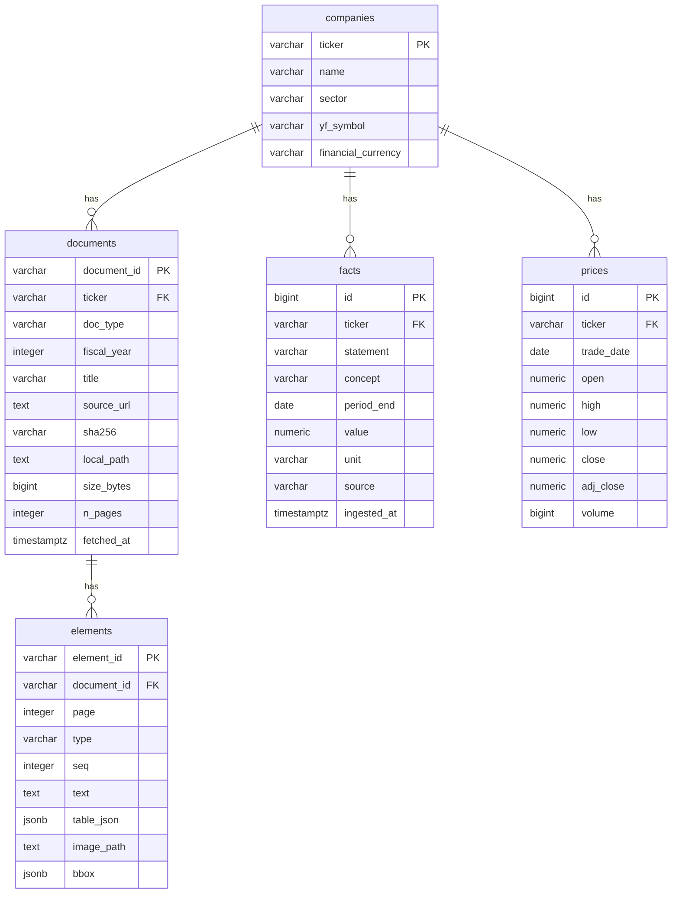

# Database schema

> **Generated file — do not edit by hand.**
> Regenerate by running `notebooks/10_generate_docs.ipynb`.
> Last generated: 2026-09-06

PostgreSQL 17, reached on host port **5433**. Schema changes are applied through Alembic migrations, never `create_all()`.

## Entity relationships

---

## `companies`

*The corpus definition. Everything joins back to `ticker`.*  — currently **12 rows**

| Column | Type | Null | Key | Default |
|---|---|---|---|---|
| `ticker` | varchar(20) | no | PK |  |
| `name` | varchar(200) | no |  |  |
| `sector` | varchar(50) | no |  |  |
| `yf_symbol` | varchar(30) | no |  |  |
| `financial_currency` | varchar(3) | no |  | `INR` |

**Constraints and indexes**

- `UNIQUE None` on `yf_symbol`
- `INDEX ix_companies_sector` on `sector`

**Notes**

- `financial_currency` is **not** the quote currency. Infosys quotes in INR and reports its statements in USD; assuming the exchange implies the currency makes it look ~85x smaller than its peers.

---

## `documents`

*One row per source PDF, with the checksum that makes it reproducible.*  — currently **6 rows**

| Column | Type | Null | Key | Default |
|---|---|---|---|---|
| `document_id` | varchar(80) | no | PK |  |
| `ticker` | varchar(20) | no | FK→companies.ticker |  |
| `doc_type` | varchar(40) | no |  |  |
| `fiscal_year` | INTEGER | no |  |  |
| `title` | varchar(300) | no |  |  |
| `source_url` | TEXT | no |  |  |
| `sha256` | varchar(64) | no |  |  |
| `local_path` | TEXT | no |  |  |
| `size_bytes` | BIGINT | no |  |  |
| `n_pages` | INTEGER | yes |  |  |
| `fetched_at` | timestamptz | no |  | `now()` |

**Constraints and indexes**

- `UNIQUE uq_documents_identity` on `ticker`, `doc_type`, `fiscal_year`
- `INDEX ix_documents_doc_type` on `doc_type`
- `INDEX ix_documents_fiscal_year` on `fiscal_year`
- `INDEX ix_documents_ticker` on `ticker`

**Notes**

- `fiscal_year` is the year the Indian FY **ends** (FY2024-25 -> 2025), which equals `EXTRACT(YEAR FROM facts.period_end)`. That alignment is what lets documents join to the oracle with no mapping table.
- `local_path` points into `data/`, which is git-ignored. The PDF is reconstructed from `source_url` + verified against `sha256`.

---

## `elements`

*Typed units extracted from each PDF, carrying page and bbox provenance.*  — currently **46,241 rows**

| Column | Type | Null | Key | Default |
|---|---|---|---|---|
| `element_id` | varchar(120) | no | PK |  |
| `document_id` | varchar(80) | no | FK→documents.document_id |  |
| `page` | INTEGER | no |  |  |
| `type` | varchar(20) | no |  |  |
| `seq` | INTEGER | no |  |  |
| `text` | TEXT | yes |  |  |
| `table_json` | JSONB | yes |  |  |
| `image_path` | TEXT | yes |  |  |
| `bbox` | JSONB | yes |  |  |

**Constraints and indexes**

- `INDEX ix_elements_doc_page` on `document_id`, `page`
- `INDEX ix_elements_document_id` on `document_id`
- `INDEX ix_elements_page` on `page`
- `INDEX ix_elements_type` on `type`

**Notes**

- `seq` is the reading order within a page. The column is not called `order` because that is a SQL keyword.
- `text` is what gets embedded. `table_json` holds the exact values. Arithmetic reads `table_json`, never `text`.
- `bbox` is `[x0, y0, x1, y1]` in PDF points, for highlighting a citation.

---

## `facts`

*Reported financial line items. **This table is the evaluation oracle.***  — currently **8,532 rows**

| Column | Type | Null | Key | Default |
|---|---|---|---|---|
| `id` | BIGINT | no | PK | auto |
| `ticker` | varchar(20) | no | FK→companies.ticker |  |
| `statement` | varchar(30) | no |  |  |
| `concept` | varchar(120) | no |  |  |
| `period_end` | DATE | no |  |  |
| `value` | NUMERIC(30, 4) | no |  |  |
| `unit` | varchar(20) | no |  |  |
| `source` | varchar(40) | no |  |  |
| `ingested_at` | timestamptz | no |  | `now()` |

**Constraints and indexes**

- `UNIQUE uq_facts_identity` on `ticker`, `statement`, `concept`, `period_end`
- `INDEX ix_facts_concept` on `concept`
- `INDEX ix_facts_period_end` on `period_end`
- `INDEX ix_facts_statement` on `statement`
- `INDEX ix_facts_ticker` on `ticker`

**Notes**

- `value` is stored in **absolute currency units**, never crore or million. Scaling happens at read time so no precision is lost at write time.
- `unit` is part of the fact's meaning: `INR`, `USD`, `INR/share`, `shares`, or `ratio`. Treating EPS as a currency amount silently corrupts every ratio.
- `Numeric(30,4)` not float: Reliance FY26 revenue is ~1.06e13, and float arithmetic on money is wrong in ways nobody notices.

---

## `prices`

*Daily OHLCV per company. The time-series half of the SQL Agent.*  — currently **14,879 rows**

| Column | Type | Null | Key | Default |
|---|---|---|---|---|
| `id` | BIGINT | no | PK | auto |
| `ticker` | varchar(20) | no | FK→companies.ticker |  |
| `trade_date` | DATE | no |  |  |
| `open` | NUMERIC(18, 4) | no |  |  |
| `high` | NUMERIC(18, 4) | no |  |  |
| `low` | NUMERIC(18, 4) | no |  |  |
| `close` | NUMERIC(18, 4) | no |  |  |
| `adj_close` | NUMERIC(18, 4) | no |  |  |
| `volume` | BIGINT | no |  |  |

**Constraints and indexes**

- `UNIQUE uq_prices_ticker_date` on `ticker`, `trade_date`
- `INDEX ix_prices_ticker` on `ticker`
- `INDEX ix_prices_ticker_date` on `ticker`, `trade_date`

**Notes**

- Rows with a NaN close are dropped before insert - see `prices.drop_partial_bar`.
- `UNIQUE (ticker, trade_date)` is what makes re-ingestion idempotent.

---
